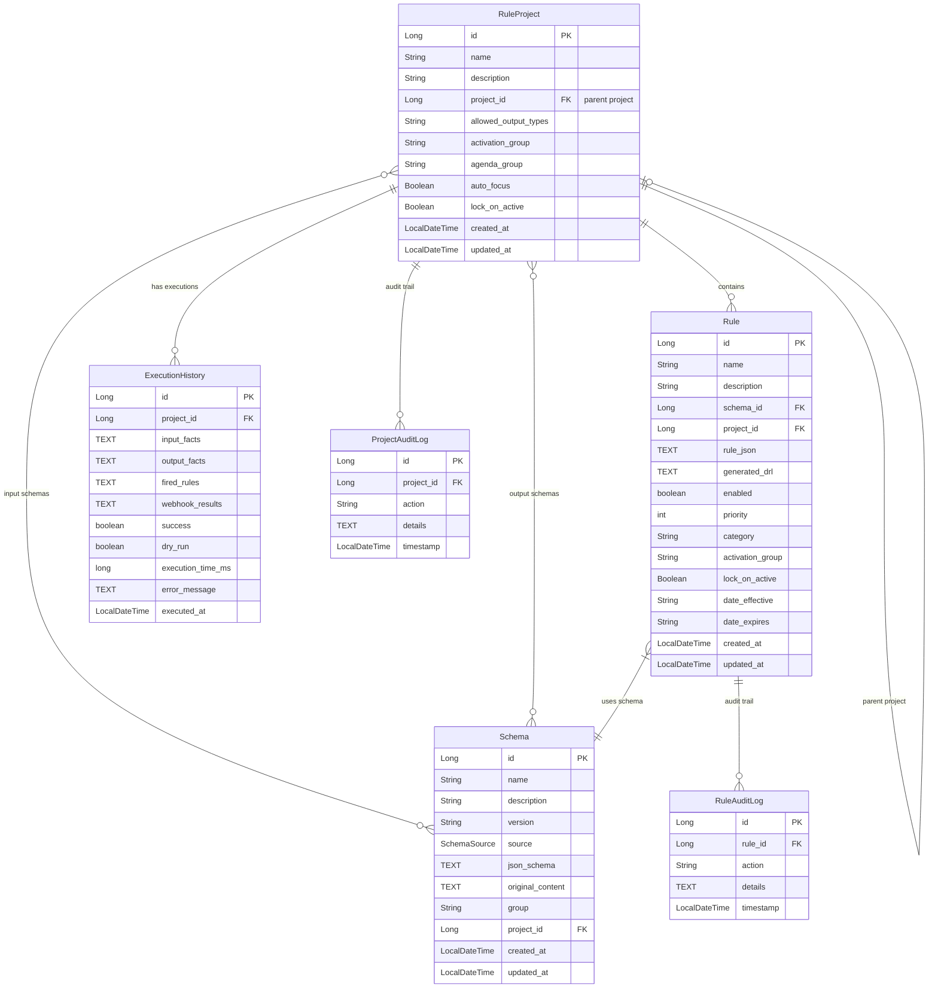

# Data Storage Architecture

This document provides a comprehensive overview of the Rule Engine's data storage architecture, including database configuration, entity models, relationships, and storage patterns.

## Table of Contents

- [Database Configuration](#database-configuration)
- [Entity Relationship Diagram](#entity-relationship-diagram)
- [Entity Models](#entity-models)
- [Repository Layer](#repository-layer)
- [Storage Patterns](#storage-patterns)
- [Migration Guide](#migration-guide)

---

## Database Configuration

### Supported Databases

The Rule Engine supports multiple database backends through Spring Profiles:

| Database | Profile | Configuration File | Use Case |
|----------|---------|-------------------|----------|
| **SQLite** | `sqlite` (default) | `application-sqlite.properties` | Local development, quick setup |
| **PostgreSQL** | `postgresql` | `application-postgresql.properties` | Production, staging |
| **MySQL** | `mysql` | `application-mysql.properties` | Production alternative |
| **H2** | `h2` | `application-h2.properties` | Testing, in-memory |

### Default Configuration (SQLite)

By default, the application uses SQLite for simplicity and zero external dependencies:

```properties
# application-sqlite.properties
spring.datasource.url=jdbc:sqlite:${SQLITE_PATH:${user.home}/.ruleengine/data/ruleengine.db}
spring.datasource.driver-class-name=org.sqlite.JDBC
spring.jpa.database-platform=org.hibernate.community.dialect.SQLiteDialect
spring.jpa.hibernate.ddl-auto=update
```

**Database file location**: `~/.ruleengine/data/ruleengine.db`

### Switching Databases

To switch to a different database, set the `spring.profiles.active` property:

```bash
# PostgreSQL
java -jar rule-engine.jar --spring.profiles.active=postgresql

# MySQL
java -jar rule-engine.jar --spring.profiles.active=mysql

# Or via environment variable
export SPRING_PROFILES_ACTIVE=postgresql
```

### PostgreSQL Configuration

```properties
spring.datasource.url=jdbc:postgresql://${POSTGRES_HOST:localhost}:${POSTGRES_PORT:5432}/${POSTGRES_DB:ruleengine}
spring.datasource.username=${POSTGRES_USER:ruleengine}
spring.datasource.password=${POSTGRES_PASSWORD:changeme}
spring.datasource.driver-class-name=org.postgresql.Driver
spring.jpa.database-platform=org.hibernate.dialect.PostgreSQLDialect
```

### MySQL Configuration

```properties
spring.datasource.url=jdbc:mysql://${MYSQL_HOST:localhost}:${MYSQL_PORT:3306}/${MYSQL_DATABASE:ruleengine}?useSSL=false&allowPublicKeyRetrieval=true
spring.datasource.username=${MYSQL_USER:ruleengine}
spring.datasource.password=${MYSQL_PASSWORD:changeme}
spring.datasource.driver-class-name=com.mysql.cj.jdbc.Driver
spring.jpa.database-platform=org.hibernate.dialect.MySQLDialect
```

---

## Entity Relationship Diagram



---

## Entity Models

### RuleProject

The central entity representing a rule project/ruleset.

**Table**: `rule_projects`

| Column | Type | Constraints | Description |
|--------|------|-------------|-------------|
| `id` | BIGINT | PK, AUTO_INCREMENT | Primary key |
| `name` | VARCHAR(255) | NOT NULL | Project name |
| `description` | TEXT | | Project description |
| `project_id` | BIGINT | FK → rule_projects | Parent project (for hierarchy/templates) |
| `allowed_output_types` | VARCHAR(255) | | Comma-separated: MODIFY, INSERT, LOG, WEBHOOK |
| `activation_group` | VARCHAR(255) | | Drools activation group |
| `agenda_group` | VARCHAR(255) | | Drools agenda group |
| `auto_focus` | BOOLEAN | | Auto-focus agenda group |
| `lock_on_active` | BOOLEAN | | Lock-on-active flag |
| `created_at` | TIMESTAMP | NOT NULL | Creation timestamp |
| `updated_at` | TIMESTAMP | NOT NULL | Last update timestamp |

**Relationships**:
- Many-to-Many with `Schema` (input schemas via `project_input_schemas` join table)
- Many-to-Many with `Schema` (output schemas via `project_output_schemas` join table)
- One-to-Many with `Rule`
- Self-referential Many-to-One (parent project hierarchy)

---

### Rule

Represents a business rule with JSON definition and compiled DRL.

**Table**: `rules`

| Column | Type | Constraints | Description |
|--------|------|-------------|-------------|
| `id` | BIGINT | PK, AUTO_INCREMENT | Primary key |
| `name` | VARCHAR(255) | NOT NULL | Rule name |
| `description` | VARCHAR(255) | | Rule description |
| `schema_id` | BIGINT | FK → schemas, NOT NULL | Associated schema |
| `project_id` | BIGINT | FK → rule_projects | Parent project |
| `rule_json` | TEXT | NOT NULL | JSON rule definition |
| `generated_drl` | TEXT | | Compiled Drools DRL |
| `enabled` | BOOLEAN | NOT NULL, DEFAULT true | Rule enabled flag |
| `priority` | INT | DEFAULT 0 | Rule priority (salience) |
| `category` | VARCHAR(255) | | Rule category |
| `activation_group` | VARCHAR(255) | | Rule-specific activation group |
| `lock_on_active` | BOOLEAN | | Lock-on-active flag |
| `date_effective` | VARCHAR(255) | | Effective date (ISO format) |
| `date_expires` | VARCHAR(255) | | Expiration date (ISO format) |
| `created_at` | TIMESTAMP | NOT NULL | Creation timestamp |
| `updated_at` | TIMESTAMP | | Last update timestamp |

---

### Schema

Represents an object schema for rule authoring (input/output context).

**Table**: `schemas`

| Column | Type | Constraints | Description |
|--------|------|-------------|-------------|
| `id` | BIGINT | PK, AUTO_INCREMENT | Primary key |
| `name` | VARCHAR(255) | NOT NULL | Schema name |
| `description` | VARCHAR(255) | | Schema description |
| `version` | VARCHAR(255) | NOT NULL | Schema version |
| `source` | ENUM | NOT NULL | SWAGGER, JSON_SCHEMA, MANUAL |
| `json_schema` | TEXT | NOT NULL | Full JSON Schema definition |
| `original_content` | TEXT | | Original import content (Swagger/OpenAPI) |
| `group` | VARCHAR(255) | | Schema grouping |
| `project_id` | BIGINT | FK → rule_projects | Associated project |
| `created_at` | TIMESTAMP | NOT NULL | Creation timestamp |
| `updated_at` | TIMESTAMP | | Last update timestamp |

**SchemaSource Enum**:
- `SWAGGER` - Imported from Swagger/OpenAPI specification
- `JSON_SCHEMA` - Imported from JSON Schema
- `MANUAL` - Manually defined

---

### ExecutionHistory

Stores execution audit trail for rule evaluations.

**Table**: `execution_history`

| Column | Type | Constraints | Description |
|--------|------|-------------|-------------|
| `id` | BIGINT | PK, AUTO_INCREMENT | Primary key |
| `project_id` | BIGINT | FK → rule_projects | Associated project |
| `input_facts` | TEXT | | JSON input facts |
| `output_facts` | TEXT | | JSON output facts (after rule execution) |
| `fired_rules` | TEXT | | JSON array of fired rule names |
| `webhook_results` | TEXT | | JSON webhook execution results |
| `success` | BOOLEAN | | Execution success flag |
| `dry_run` | BOOLEAN | | Dry run flag (no side effects) |
| `execution_time_ms` | BIGINT | | Execution duration in milliseconds |
| `error_message` | TEXT | | Error message if failed |
| `executed_at` | TIMESTAMP | NOT NULL | Execution timestamp |

---

## Repository Layer

All repositories extend Spring Data JPA's `JpaRepository` for automatic CRUD operations.

**Location**: `com.ruleengine.repository`

| Repository | Entity | Key Methods |
|------------|--------|-------------|
| `RuleProjectRepository` | RuleProject | Standard CRUD |
| `RuleRepository` | Rule | `findByProjectId()`, `findBySchemaId()` |
| `SchemaRepository` | Schema | `findByProjectId()`, `findBySource()` |
| `ExecutionHistoryRepository` | ExecutionHistory | `findByProjectIdOrderByExecutedAtDesc()` |
| `ProjectAuditLogRepository` | ProjectAuditLog | `findByProjectIdOrderByTimestampDesc()` |
| `RuleAuditLogRepository` | RuleAuditLog | `findByRuleIdOrderByTimestampDesc()` |

---

## Storage Patterns

### JSON Storage Strategy

The Rule Engine uses JSON extensively for flexible, schema-less storage:

| Field | Storage | Purpose |
|-------|---------|---------|
| `Rule.ruleJson` | TEXT/CLOB | Visual rule builder JSON definition |
| `Rule.generatedDrl` | TEXT/CLOB | Compiled Drools Rule Language |
| `Schema.jsonSchema` | TEXT/CLOB | Full JSON Schema for validation |
| `ExecutionHistory.inputFacts` | TEXT/CLOB | Execution input payload |
| `ExecutionHistory.outputFacts` | TEXT/CLOB | Execution output payload |
| `ExecutionHistory.firedRules` | TEXT/CLOB | Array of fired rule names |

### Rule JSON Structure Example

```json
{
  "conditions": {
    "all": [
      {
        "field": "applicant.creditScore",
        "operator": ">=",
        "value": 700
      },
      {
        "field": "loan.amount",
        "operator": "<=",
        "value": 500000
      }
    ]
  },
  "actions": [
    {
      "type": "MODIFY",
      "target": "loan.approved",
      "value": true
    }
  ]
}
```

### Schema JSON Structure Example

```json
{
  "type": "object",
  "properties": {
    "applicant": {
      "type": "object",
      "properties": {
        "name": { "type": "string" },
        "creditScore": { "type": "integer", "minimum": 300, "maximum": 850 },
        "income": { "type": "number" }
      }
    },
    "loan": {
      "type": "object",
      "properties": {
        "amount": { "type": "number" },
        "term": { "type": "integer" },
        "approved": { "type": "boolean" }
      }
    }
  }
}
```

---

## Migration Guide

### From SQLite to PostgreSQL

1. **Export data from SQLite**:
   ```bash
   sqlite3 ~/.ruleengine/data/ruleengine.db .dump > backup.sql
   ```

2. **Create PostgreSQL database**:
   ```sql
   CREATE DATABASE ruleengine;
   CREATE USER ruleengine WITH PASSWORD 'changeme';
   GRANT ALL PRIVILEGES ON DATABASE ruleengine TO ruleengine;
   ```

3. **Start application with PostgreSQL profile**:
   ```bash
   java -jar rule-engine.jar --spring.profiles.active=postgresql
   ```
   > Hibernate will auto-create the schema on first run.

4. **Migrate data** using a migration tool or custom scripts.

### Using Docker Compose

The project includes a `docker-compose.yml` for PostgreSQL/MySQL:

```bash
# Start database containers
docker-compose up -d postgres

# Or for MySQL
docker-compose up -d mysql
```

---

## Best Practices

1. **Use SQLite for development** - Zero setup, file-based, perfect for local work
2. **Use PostgreSQL for production** - Better concurrency, full SQL support, proven scalability
3. **Enable audit logging** - `ProjectAuditLog` and `RuleAuditLog` track all changes
4. **Regular backups** - SQLite: copy the `.db` file; PostgreSQL: use `pg_dump`
5. **Index optimization** - For production, add indexes on frequently queried columns like `project_id`, `schema_id`

---

## Environment Variables

| Variable | Default | Description |
|----------|---------|-------------|
| `SQLITE_PATH` | `~/.ruleengine/data/ruleengine.db` | SQLite database file path |
| `POSTGRES_HOST` | `localhost` | PostgreSQL host |
| `POSTGRES_PORT` | `5432` | PostgreSQL port |
| `POSTGRES_DB` | `ruleengine` | PostgreSQL database name |
| `POSTGRES_USER` | `ruleengine` | PostgreSQL username |
| `POSTGRES_PASSWORD` | `changeme` | PostgreSQL password |
| `MYSQL_HOST` | `localhost` | MySQL host |
| `MYSQL_PORT` | `3306` | MySQL port |
| `MYSQL_DATABASE` | `ruleengine` | MySQL database name |
| `MYSQL_USER` | `ruleengine` | MySQL username |
| `MYSQL_PASSWORD` | `changeme` | MySQL password |

---

## Multi-Tenancy Architecture

For SaaS deployments, Truly uses a **database-per-tenant** strategy with SQLite:

```
~/.ruleengine/
├── data/
│   ├── master.db           # Tenant registry, users, billing
│   ├── tenants/
│   │   ├── tenant_abc123.db   # Tenant A (complete isolation)
│   │   ├── tenant_def456.db   # Tenant B (complete isolation)
│   │   └── tenant_ghi789.db   # Tenant C (complete isolation)
│   └── backups/
```

### Key Benefits

| Benefit | Description |
|---------|-------------|
| **Complete Isolation** | No data leak risk - each tenant is a separate file |
| **Simple Backups** | Backup = copy file; Restore = replace file |
| **Easy Deletion** | Delete tenant = delete database file |
| **Fast Provisioning** | New tenant = create new .db file (~1ms) |
| **No Schema Complexity** | No `tenant_id` columns or query filters needed |

### Tenant Routing

```java
// Request flow:
// 1. Extract tenant ID from JWT/API key
// 2. Route to correct SQLite database file
// 3. Execute query against tenant-specific database

public class TenantRoutingDataSource extends AbstractRoutingDataSource {
    @Override
    protected Object determineCurrentLookupKey() {
        return TenantContext.getTenantId();  // Thread-local tenant
    }
}
```

> **Full Documentation**: See [Multi-Tenancy Architecture](./multi-tenancy.md) for complete implementation details including connection pooling, security, and scaling strategies.
